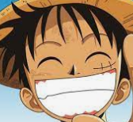

# Index

[TOC]

## 编码

| 数字 | 人物                                                | 颜色                                      | 道具         |
| ---- | --------------------------------------------------- | ----------------------------------------- | ------------ |
| 1    | 路飞       | 红色       | 棍子，旗杆   |
| 2    | 娜美       | 橙色    | 鸭子         |
| 3    | 山治       | 黄色    | 弹簧         |
| 4    | 乔巴       | 白色     | 椅子         |
| 5    | 乌索普     | 红色       | 手套，网     |
| 6    | 罗宾       | 巧克力色 | 耳坠         |
| 7    | 佐罗       | 绿色     | 镰刀         |
| 8    | 白熊       | 白色     | 眼镜，bra    |
| 9    | 多弗朗明哥 | 粉色      | 围巾         |
| 0    | 黑胡子     | 黑色     | 甜甜圈，气球 |

## 卡牌编码

